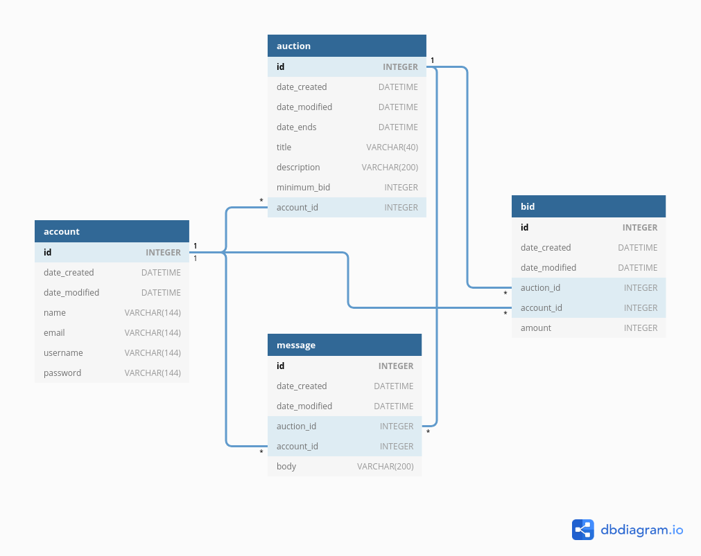

# Huutokauppa

Yksinkertaisen nettihuutokaupan toteuttava tietokantasovellus. Käyttäjä luo ensin
itselleen tunnuksen, minkä jälkeen hän voi ilmoittaa tavaraa myytäväksi huutokaupassa
tai osallistua huutamiseen aktiivisissa huutokaupoissa. Kun huutokauppa sulkeutuu,
ostaja (korkeimman huudon tekijä) ja myyjä saavat toistensa yhteystiedot kaupantekoa
varten.

### Toteutetut toiminnot

* käyttäjän luonti
* käyttäjätietojen muokkaus
* huutokaupan luonti
* huutokaupan muokkaus
* aktiivisten huutokauppojen listaus ja katselu
* päättyneiden huutokauppojen listaus ja katselu
* huutaminen
* niiden huutokauppojen listaus, joissa käyttäjä on osallistunut huutamiseen, sekä onko oma huuto voittava vai häviävä tällä hetkellä
* toteutuneiden kauppojen listaus ja yhteenvetotiedot
* viestipalsta huutokaupan yhteydessä

### Tietokantakaavio

(Tietokantakaaviosta puuttuu taulu message)

### Ideoita, joita ei ehditty toteuttaa

* myytävien tavaroiden lajittelu kategorioihin
* korotusautomaatti

### Sovelluksessa olevia vikoja ja puutteita

* Listauksia ei sivuteta, joten tietokannan suurentuessa on odotettavissa ongelmia.
* Sovelluksen ulkoasu ja käyttöliittymä kaipaisi parannusta.
* Käyttäjän pitäisi selkeämmin saada tieto siitä, että hän on voittanut huutokaupan tai että hänen oma huutokauppansa on päättynyt.
* Käyttäjärooleja ei ole toteutettu. Käyttäjätunnuksia ei voi poistaa.
* Viestipalstan viestejä ei voi muokata.
